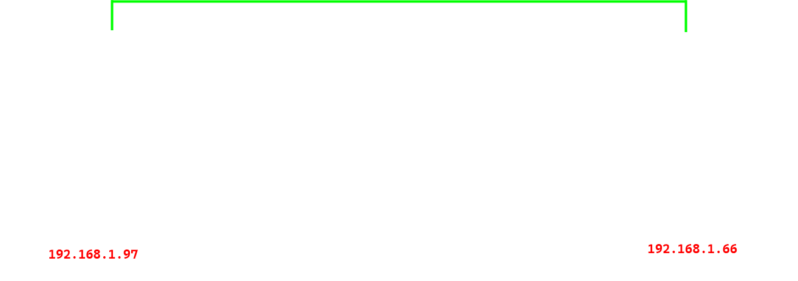

    

 

    <h4>Simple and lightweight keylogger made with Python</h4>

This project is a simple keylogger written in python for educational purposes. It captures keystrokes from the keyboard, saves the captured words into a text file (`output.txt`), and optionally sends the file to a remote machine over network.

## Features

### Capture printable keystrokes

The program uses the `keyboard` library to detect and record any printable characters typed by the user. Special keys like `Shift` and `Ctrl` are ignored, focusing only on characters that form meaningful input.

### Detects and processes words

When the user types, characters are accumulated into a `word` variable. Once the space key is pressed, the word is saved into a text file (`output.txt`) and the variable is reset, allowing the program to efficiently handle word-by-word input.

### Stores data in a file

The captured words are stored in a file named `output.txt`. This file is created in the same directory as the script if it does not already exist. Data is appended to the file to ensure that no information is lost between sessions.

### Sends capture data toa remote machine

Upon termination of the program (by pressing `ESC`), the `output.txt` file is transmitted to a specified remote machine using TCP sockets. The IP address and port of the receiving machine can be dynamically set using command-line arguments.

### Customizable IP address and port

The program accepts the IP address and port of the remote machine as command-line arguments, making it adaptable to different network configurations and scenarios.

### POC

    

|      Machine      |       IP        |
|-------------------|-----------------|
|  Atacker Machine  |   192.168.1.97  |
|  Victim Machine   |   192.168.1.66  |

## License

This project is under <a href="https://github.com/sporestudio/dns-server/blob/main/LICENSE">GNU General Public License v3.0</a>

## Contributions

Contributions are welcome! Feel free to fork the repository, submit issues, or create pull requests.

## Author

Created by <a href="https://github.com/sporestudio">sporestudio</a>.